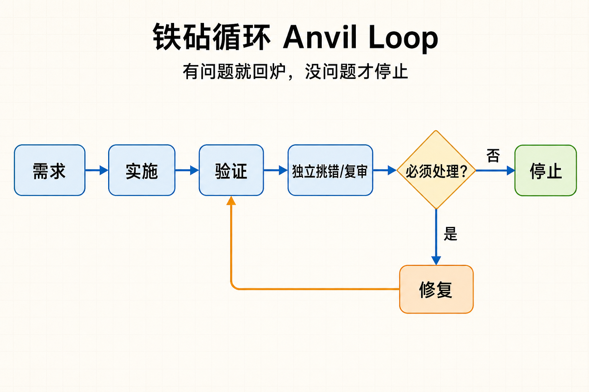

# Anvil Loop

A hardening workflow for changes that need more than a happy-path pass.

```text
contract → implement → verify → break/review → fix → re-verify → re-break/review → stop
```

Use it when a change touches risk: deploys, migrations, backups, auth, credentials, rollback, CLI/tools, filesystem/process handling, generated artifacts, or operational docs people may copy-paste.



Generated with `image_gen` / `openai-codex` / `gpt-image-2-medium`. A deterministic HTML/SVG fallback is in [`assets/anvil-loop-flowchart.zh.html`](assets/anvil-loop-flowchart.zh.html).

In the graph, `必须处理？` means a blocker or proven issue that must be handled before shipping. Non-blockers can be documented, accepted, or deferred.

## What it means

Do not stop at “it works once.”

1. State the contract.
2. Implement the smallest useful change.
3. Verify directly.
4. Get independent break/review.
5. Classify findings.
6. Convert real findings into tests, repros, or exact doc evidence.
7. Fix only proven problems.
8. Re-run checks and break/review again.
9. Stop only when there are no blockers.

If no independent reviewer is available, label it as self-review and do not claim the anvil loop is complete.

## Hermes skill

Canonical skill file:

`skills/software-development/anvil-loop-development/SKILL.md`

For a local Hermes install, use the raw skill URL:

```bash
hermes skills install \
  https://raw.githubusercontent.com/getaskclaw/anvil-loop/main/skills/software-development/anvil-loop-development/SKILL.md \
  --category software-development
```

Manual fallback, run from this repo root:

```bash
mkdir -p ~/.hermes/skills/software-development/anvil-loop-development
cp skills/software-development/anvil-loop-development/SKILL.md \
  ~/.hermes/skills/software-development/anvil-loop-development/SKILL.md
hermes skills list | grep anvil-loop-development
```

Then start a new Hermes session. In an existing CLI session use `/reset`; in Telegram/Discord gateway use `/restart` if the tool/skill list does not refresh. Load it with `/skill anvil-loop-development`.

There is intentionally no root `SKILL.md`, to avoid duplicate drift.

## Minimal checklist

- [ ] Contract stated
- [ ] Intended files only changed
- [ ] Tests/build or Markdown smoke checks passed
- [ ] Independent review completed
- [ ] Blockers fixed with evidence
- [ ] Checks re-run after fixes
- [ ] Re-review completed if blockers were found
- [ ] Final state and limitations reported plainly

## License

MIT
